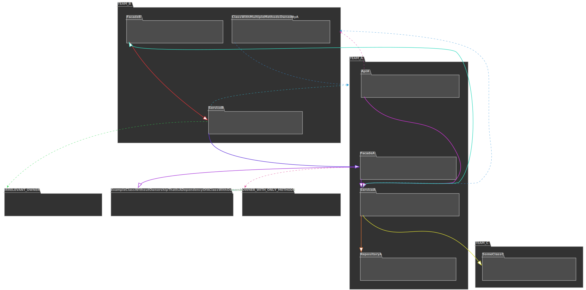

# Overview

The `ownership-plotter` is a tool for visualizing bounded context based on annotations present in the code.

It is designed with customization in mind: you can choose which parts of your application to visualize.

Example diagram from the "perspective" of `TEAM_A`:



# Usage

## Requirements

The tool depends on PlantUML for generating diagrams, which in turn requires [Graphviz](https://graphviz.org/download/) to be installed.

## Installation

To install the tool in your local Maven repository, use the following command:

```bash
maven clean install -DskipTests
```

This will put all `.jar` files in your `~/.m2` directory, making the tool visible for other projects.

## Setup in project

To enable the tool in your project, add it as Maven or Gradle dependency:

```xml
<dependency>
  <groupId>com.glovoapp</groupId>
  <artifactId>ownership-plotter</artifactId>
  <version>${ownershipPlotter.version}</version>
</dependency>
```

```groovy
testImplementation "com.glovoapp:ownership-plotter:${ownershipPlotter.version}"
```

replacing `${ownershipPlotter.version}` with the desired version of the tool.

## Creating the diagram

The easiest way to create a domain diagram is with a test, for example:

```java
class PlotOwnershipTest {

    @Test
    void shouldPlotOwnership() {
        new ClassOwnershipPlotter(
            new ReflectionsClasspathLoader(),
            new CachedClassOwnershipExtractor(
                new AnnotationBasedClassOwnershipExtractor(
                    define(YourOwnershipAnnotation.class)
                )
            ),
            it -> it,
            pipelineForFile(FileFormat.SVG, defaultDiagramConfiguration())
        ).writeDiagramOfClasspathToFile("com.example", "/tmp/com-example-domain.svg");
    }

}
``` 

You can filter the classes that you wish to include in the diagram by adding "ownership filters":

```java
DomainOwnershipFilter.simple(
    isOwnedBy("my-wonderful-team").and(
       isADependencyOfAClassThat(isOwnedBy("my-wonderful-team"))
    )
)
```

If the class matches any of the filters, it will be included in the result.
In the example above, all classes owned by "my-wonderful-team" or all dependencies of classes owned by "my-wonderful-team" will be included.

There are various filters available.
You can compose them to generate the exact diagram you are looking for.

### Important note

The `writeDiagramOfClasspathToFile` method uses `reflections` library to scan the entire classpath.
This will effectively load all available classes.

The tool should not be used outside of tests to avoid decreasing performance of your application.